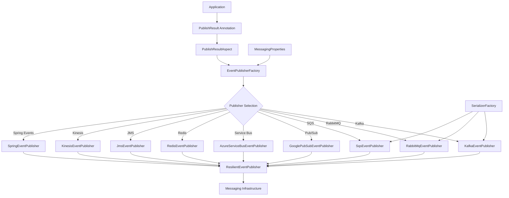
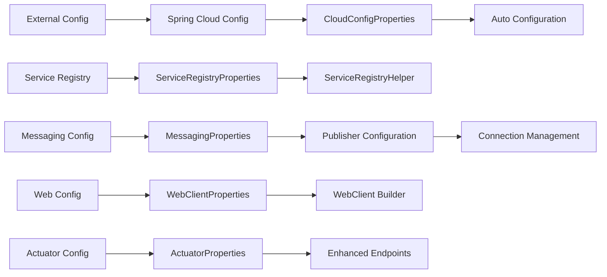
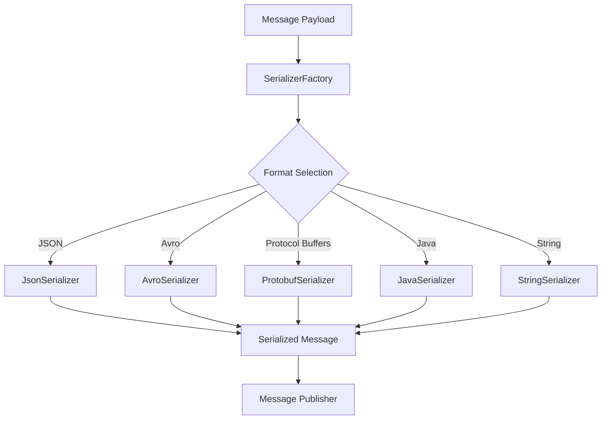
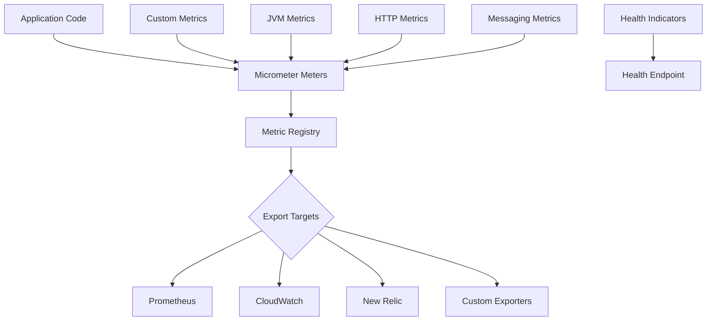
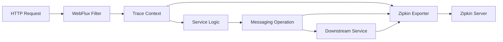
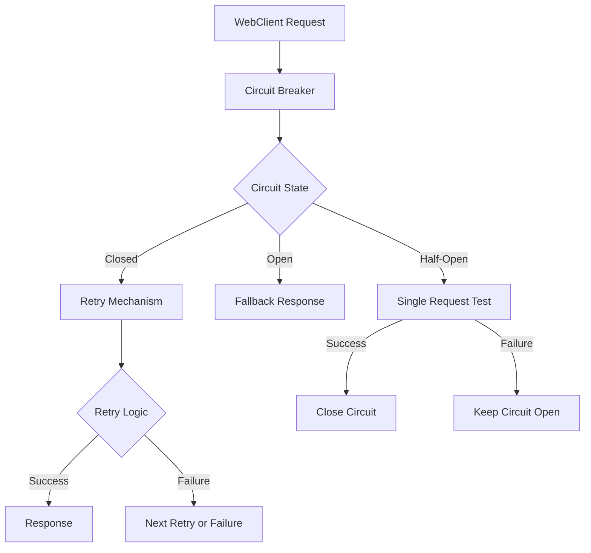
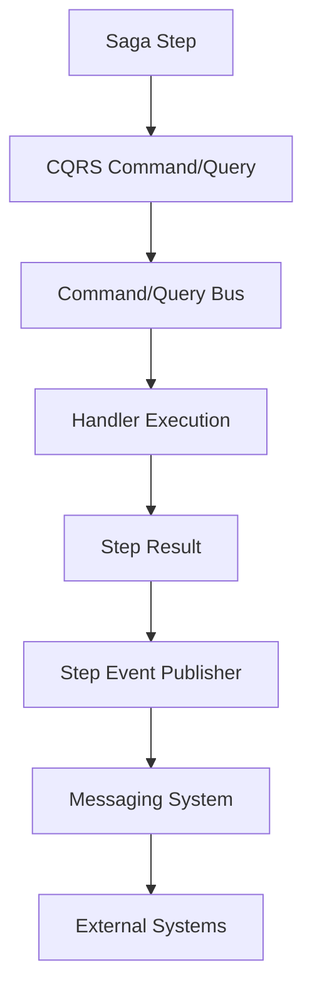

# Architecture Overview

**Firefly Common Core Library**  
*Copyright (c) 2025 Firefly Software Solutions Inc*  
*Licensed under the Apache License, Version 2.0*

This document provides architectural documentation for the Firefly Common Core library, a core-infrastructure component of the **Firefly Framework**.

## Table of Contents

- [System Architecture](#system-architecture)
- [Module Structure](#module-structure)
- [Component Interactions](#component-interactions)
- [Messaging Architecture](#messaging-architecture)
- [Configuration Management](#configuration-management)
- [Observability Stack](#observability-stack)
- [Web Layer](#web-layer)
- [Integration Patterns](#integration-patterns)
- [Design Patterns](#design-patterns)
- [Extension Points](#extension-points)

## System Architecture

Firefly Common Core follows a layered, modular architecture designed for enterprise and mission-critical applications. The system is built on Spring Boot 3.5.10 with reactive programming support using Project Reactor.

### Platform Integration

This library serves as the infrastructure layer within the Firefly Framework:

```
Firefly Framework
├── Application Services (Domain Services, etc.)
├── Domain Layer (fireflyframework-domain)
│   ├── Domain Models & Entities
│   ├── Business Logic & Rules
│   └── Domain Events
└── Infrastructure Layer (fireflyframework-core) ← This Library
    ├── Messaging Abstraction
    ├── Configuration Management  
    ├── WebClient Enhancements
    ├── Observability Tools
    └── Integration Utilities
```

```
┌─────────────────────────────────────────────────────────────┐
│                    Application Layer                        │
├─────────────────────────────────────────────────────────────┤
│                  Integration Layer                          │
│  ┌─────────────────┐  ┌─────────────────┐  ┌──────────────┐│
│  │  CQRS/Saga      │  │  Step Events    │  │  Transactional││
│  │  Integration    │  │  Publisher      │  │  Engine      ││
│  └─────────────────┘  └─────────────────┘  └──────────────┘│
├─────────────────────────────────────────────────────────────┤
│                     Core Services Layer                     │
│  ┌─────────────────┐  ┌─────────────────┐  ┌──────────────┐│
│  │   Messaging     │  │   Web Client    │  │  Service     ││
│  │   Publishers    │  │   Resilience    │  │  Discovery   ││
│  └─────────────────┘  └─────────────────┘  └──────────────┘│
├─────────────────────────────────────────────────────────────┤
│                Configuration & Observability                │
│  ┌─────────────────┐  ┌─────────────────┐  ┌──────────────┐│
│  │  Cloud Config   │  │   Actuator      │  │  Metrics &   ││
│  │  Management     │  │   Health        │  │  Tracing     ││
│  └─────────────────┘  └─────────────────┘  └──────────────┘│
├─────────────────────────────────────────────────────────────┤
│                      Infrastructure Layer                   │
│  ┌─────────────────┐  ┌─────────────────┐  ┌──────────────┐│
│  │   Messaging     │  │   Spring        │  │  External    ││
│  │   Providers     │  │   Framework     │  │  Services    ││
│  └─────────────────┘  └─────────────────┘  └──────────────┘│
└─────────────────────────────────────────────────────────────┘
```

### Key Architectural Principles

1. **Reactive Programming**: Built on Project Reactor for non-blocking operations
2. **Modular Design**: Clear separation of concerns with pluggable components
3. **Configuration-Driven**: Extensive externalized configuration support
4. **Resilience-First**: Built-in circuit breakers, retries, and failover mechanisms
5. **Observability**: Comprehensive metrics, tracing, and health checks
6. **Multi-Provider Support**: Abstract interfaces with multiple implementation choices

## Module Structure

The library is organized into the following main packages:

### Package Structure

```
org.fireflyframework.core/
├── actuator/                    # Enhanced Spring Boot Actuator
│   ├── config/                  # Actuator configuration
│   └── health/                  # Custom health indicators
├── config/                      # Core configuration management
│   ├── cloud/                   # Spring Cloud Config integration
│   └── registry/                # Service discovery configuration
├── logging/                     # Logging utilities and configuration
│   ├── config/                  # Logging configuration
│   └── examples/                # Logging examples
├── messaging/                   # Multi-provider messaging system
│   ├── annotation/              # Messaging annotations
│   ├── aspect/                  # AOP aspects for messaging
│   ├── config/                  # Messaging configuration
│   ├── error/                   # Error handling
│   ├── event/                   # Event definitions
│   ├── handler/                 # Message handlers
│   ├── health/                  # Messaging health indicators
│   ├── metrics/                 # Messaging metrics
│   ├── processor/               # Event processors
│   ├── publisher/               # Message publishers
│   ├── resilience/              # Resilience patterns
│   ├── serialization/           # Message serialization
│   ├── shutdown/                # Graceful shutdown
│   ├── stepevents/              # Saga step event integration
│   └── subscriber/              # Message subscribers
└── web/                         # Reactive web capabilities
    ├── client/                  # WebClient enhancements
    └── resilience/              # Web resilience patterns
```

## Component Interactions

### Messaging System Architecture



### Configuration Flow



## Messaging Architecture

### Publisher Architecture

The messaging system uses a factory pattern with multiple publisher implementations:

#### EventPublisher Interface

```java
public interface EventPublisher {
    Mono<Void> publish(String destination, String eventType, Object payload, String transactionId);
    Mono<Void> publish(String destination, String eventType, Object payload, String transactionId, MessageSerializer serializer);
    boolean isAvailable();
}
```

#### Connection-Aware Publishers

```java
public interface ConnectionAwarePublisher {
    void setConnectionId(String connectionId);
    String getConnectionId();
}
```

### Publisher Implementations

| Publisher | Implementation Class | Key Features |
|-----------|---------------------|--------------|
| **Kafka** | `KafkaEventPublisher` | Topic-based, high throughput, ordered delivery |
| **RabbitMQ** | `RabbitMqEventPublisher` | Exchange/routing key, flexible routing |
| **AWS SQS** | `SqsEventPublisher` | Queue-based, managed service, FIFO support |
| **Google Pub/Sub** | `GooglePubSubEventPublisher` | Topic-based, global distribution |
| **Azure Service Bus** | `AzureServiceBusEventPublisher` | Topics/queues, enterprise features |
| **Redis** | `RedisEventPublisher` | Pub/Sub channels, in-memory speed |
| **JMS** | `JmsEventPublisher` | Standard API, enterprise messaging |
| **Kinesis** | `KinesisEventPublisher` | Streaming, real-time processing |
| **Spring Events** | `SpringEventPublisher` | In-process events, Spring integration |

### Serialization Architecture



## Configuration Management

### Auto-Configuration Classes

The library provides extensive auto-configuration support:

| Auto-Configuration Class | Purpose | Condition |
|--------------------------|---------|-----------|
| `MessagingConfig` | Core messaging setup | `messaging.enabled=true` |
| `CloudConfigAutoConfiguration` | Spring Cloud Config | Cloud config dependency present |
| `ServiceRegistryAutoConfiguration` | Service discovery | Service registry dependency present |
| `WebFluxConfig` | Reactive web setup | WebFlux on classpath |
| `ActuatorConfig` | Enhanced actuator | Actuator dependency present |
| `StepEventsAutoConfiguration` | Step events integration | `step-events.enabled=true` |
| `TransactionalEngineAutoConfiguration` | Transactional engine | Transactional engine on classpath |

### Configuration Properties

```yaml
# Core configuration properties structure
messaging:
  enabled: boolean
  resilience: boolean
  publish-timeout-seconds: int
  default-connection-id: string
  serialization:
    default-format: SerializationFormat
  kafka: KafkaConfig
  kafka-connections: Map<String, KafkaConfig>
  rabbitmq: RabbitMqConfig
  # ... other messaging providers

cloud:
  config:
    enabled: boolean
    uri: string
    name: string
    profile: string
    label: string
    fail-fast: boolean

service:
  registry:
    enabled: boolean
    type: RegistryType
    eureka: EurekaConfig
    consul: ConsulConfig

webclient:
  enabled: boolean
  connect-timeout-ms: int
  read-timeout-ms: int
  connection-pool: ConnectionPoolConfig

management:
  endpoints: EndpointsConfig
  metrics: MetricsConfig
  tracing: TracingConfig
```

## Observability Stack

### Metrics Architecture



### Health Check Components

| Health Indicator | Class | Purpose |
|------------------|-------|---------|
| **Messaging** | `MessagingHealthIndicator` | Check all enabled messaging systems |
| **Database** | Custom implementations | Database connection health |
| **Disk Space** | Spring Boot default | Available storage monitoring |
| **Service Registry** | Custom implementations | Eureka/Consul connectivity |

### Distributed Tracing



## Web Layer

### WebClient Architecture

```java
// WebClient configuration hierarchy
WebClientProperties
├── ConnectionPoolConfig
├── SslConfig
├── ProxyConfig
├── Http2Config
└── CodecConfig

// Builder customization
WebClient.Builder
├── ConnectionProvider (from connection pool config)
├── HttpClient (with SSL, proxy, timeouts)
├── ExchangeStrategies (codec configuration)
└── Default headers and filters
```

### Resilience Patterns



## Integration Patterns

### CQRS Integration



### Step Events Flow

```java
@SagaStep(id = "validate-customer")
public Mono<CustomerValidationResult> validateCustomer(@Input CustomerRegistrationRequest request) {
    // 1. Execute CQRS query
    ValidateCustomerQuery query = ValidateCustomerQuery.builder()
        .email(request.getEmail())
        .phoneNumber(request.getPhoneNumber())
        .build();
    
    // 2. Saga engine automatically publishes step events via StepEventPublisherBridge
    return queryBus.execute(query);
    // 3. Step completion triggers event publication to configured messaging system
}
```

### Connection Management

```mermaid
graph TB
    A[PublishResult Annotation] --> B[Connection ID Resolution]
    B --> C{Connection Type}
    
    C -->|Default| D[Default Connection]
    C -->|Named| E[Named Connection Lookup]
    
    D --> F[MessagingProperties.getKafkaConfig("default")]
    E --> G[MessagingProperties.getKafkaConfig(connectionId)]
    
    F --> H[Publisher Instance]
    G --> H
    
    H --> I[ConnectionAwarePublisher.setConnectionId()]
    I --> J[Message Publication]
```

## Design Patterns

### Factory Pattern

```java
// EventPublisherFactory creates appropriate publishers
@Component
public class EventPublisherFactory {
    private final Map<String, EventPublisher> publisherMap;
    
    public EventPublisher createPublisher(PublisherType type, String connectionId) {
        EventPublisher publisher = publisherMap.get(type.name().toLowerCase());
        if (publisher instanceof ConnectionAwarePublisher) {
            ((ConnectionAwarePublisher) publisher).setConnectionId(connectionId);
        }
        return new ResilientEventPublisher(publisher, resilienceProperties);
    }
}
```

### Decorator Pattern

```java
// ResilientEventPublisher wraps actual publishers with resilience
public class ResilientEventPublisher implements EventPublisher {
    private final EventPublisher delegate;
    private final CircuitBreaker circuitBreaker;
    
    @Override
    public Mono<Void> publish(String destination, String eventType, Object payload, String transactionId) {
        return circuitBreaker.executeSupplier(() ->
            delegate.publish(destination, eventType, payload, transactionId)
                .retryWhen(Retry.backoff(maxRetries, minBackoff))
        );
    }
}
```

### Strategy Pattern

```java
// Serialization strategy selection
public class SerializerFactory {
    private final Map<SerializationFormat, MessageSerializer> serializers;
    
    public MessageSerializer getSerializer(SerializationFormat format) {
        return serializers.getOrDefault(format, defaultSerializer);
    }
}
```

### Observer Pattern

```java
// Event-driven architecture for step events
@Component
public class StepEventPublisherBridge implements StepEventPublisher {
    @Override
    public Mono<Void> publishStepEvent(StepEvent event) {
        return eventPublisher.publish(
            stepEventsProperties.getEventDestination(),
            event.getEventType(), 
            event.getPayload(),
            event.getTransactionId()
        );
    }
}
```

## Extension Points

### Custom Publishers

```java
@Component
@ConditionalOnProperty(prefix = "messaging.custom", name = "enabled", havingValue = "true")
public class CustomEventPublisher implements EventPublisher, ConnectionAwarePublisher {
    @Override
    public Mono<Void> publish(String destination, String eventType, Object payload, String transactionId) {
        // Custom implementation
    }
}
```

### Custom Serializers

```java
@Component
public class CustomSerializer implements MessageSerializer {
    @Override
    public byte[] serialize(Object payload) throws SerializationException {
        // Custom serialization logic
    }
    
    @Override
    public SerializationFormat getFormat() {
        return SerializationFormat.CUSTOM;
    }
}
```

### Custom Health Indicators

```java
@Component
public class CustomHealthIndicator implements HealthIndicator {
    @Override
    public Health health() {
        // Custom health check logic
        return Health.up()
            .withDetail("custom.metric", getValue())
            .build();
    }
}
```

### Custom Metrics

```java
@Component
public class CustomMetrics {
    private final Counter customCounter;
    private final Timer customTimer;
    
    public CustomMetrics(MeterRegistry meterRegistry) {
        this.customCounter = Counter.builder("custom.operations")
            .description("Custom operation count")
            .register(meterRegistry);
            
        this.customTimer = Timer.builder("custom.duration")
            .description("Custom operation duration")
            .register(meterRegistry);
    }
}
```

### Event Processors

```java
@Component
public class CustomEventProcessor implements EventProcessor<CustomEvent> {
    @Override
    @EventListener
    public Mono<Void> process(@EventPayload CustomEvent event) {
        // Custom event processing logic
        return processEvent(event);
    }
}
```

This architecture provides a solid foundation for building reactive, resilient, and observable microservices while maintaining flexibility for customization and extension.